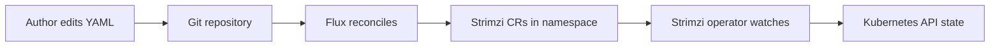

# feat: Strimzi portfolio web section (item 7)

## Overview

Add a long-form portfolio section that explains Strimzi for a platform/SRE audience, centered on a GitOps (Flux) + Strimzi reconciliation diagram. The section turns the brainstorm talk track into scannable page structure, embeds the architecture diagram with correct alt text, and keeps claims aligned with what is verifiable from public docs and the reader’s own experience.

## Problem Frame

The portfolio needs a credible “Streaming & messaging” story that is not generic marketing copy. The primary reader is a platform/SRE/Kubernetes engineer evaluating whether the author understands operators, reconciliation, GitOps boundaries, and operational failure modes.

## Requirements Trace

- R1. Deliver a **web section** (not a slide-first artifact) suitable for a main portfolio site.
- R2. **Diagram-led narrative**: the page walks Git → Flux → namespaced Strimzi CRs → Strimzi operator → Kubernetes API.
- R3. **Audience lock**: language and depth match platform/SRE readers (nested controllers, blast radius, status conditions, layered observability).
- R4. **Credibility hygiene**: illustrative YAML and topology are clearly labeled when they are examples rather than claims about a specific employer system.
- R5. **Discoverability in the deployed portfolio**: the section is linked from the deployed site’s index/navigation using the same patterns as other portfolio items. (Satisfied in the repository that actually ships the site; see staging model below.)
- R6. **Two-loop framing**: the copy explicitly separates Flux’s reconciliation loop from Strimzi’s reconciliation loop, with a dedicated subsection or paired paragraphs (not only a diagram).

## Scope Boundaries

- Non-goal: provisioning a real cluster, deploying Strimzi, or maintaining production runbooks in this repository.
- Non-goal: replacing official Strimzi or Flux documentation; the page links out for depth.
- Non-goal: inventing benchmark numbers or uptime promises without a cited source.

## Staging model (pick one before Unit 4)

- **Stage A — This repo is the portfolio site:** Units 2–5 run here; R5 is verified against this repo’s navigation and routes.
- **Stage B — This repo is a content/asset stub:** Units 1–2 produce portable source files and a handoff checklist; **Unit 4 is executed in the deployment repository** that owns navigation. R5 is verified only after the handoff. The README records which stage applies.

## Context & Research

### Relevant Code and Patterns

- As of `date` in frontmatter, the repository root contained no tracked site framework files: no `AGENTS.md`, no established content paths. Implementation must either **bootstrap** the portfolio site in this repo or **define integration steps** for an existing main portfolio repository (paths in the implementation units are placeholders until the target stack is present).

### Institutional Learnings

- No `docs/solutions/` content found in this workspace.

### External References

- Strimzi documentation: `https://strimzi.io/documentation/`
- Flux documentation: `https://fluxcd.io/flux/`

## Key Technical Decisions

- **Content-first delivery**: ship the section as structured Markdown/MDX (or the main site’s native content format) so the diagram and narrative can iterate without locking into animation-heavy deck tooling.
- **Two-loop framing**: separate GitOps reconciliation (Flux) from domain reconciliation (Strimzi) to match how platform engineers debug incidents.
- **Diagram asset**: store a copy under a repo-relative public path (for example `public/images/strimzi-gitops-flux.png`) and reference it from the page; keep a short caption that names each box and arrow.

## Open Questions

### Resolved During Planning

- **Primary artifact**: web section on the main portfolio site (not slides-only).
- **Primary audience**: platform/SRE/Kubernetes engineers.

### Deferred to Implementation

- **Exact framework and paths**: depend on the main portfolio stack (Next.js, Astro, Eleventy, etc.) and its content conventions.
- **URL slug and navigation label**: depend on the site’s information architecture.

## High-Level Technical Design

> *This illustrates the intended approach and is directional guidance for review, not implementation specification. The implementing agent should treat it as context, not code to reproduce.*

## Implementation Units

- [x] **Unit 1: Repository and asset baseline**

**Goal:** Make the Strimzi workspace capable of hosting the section and diagram in a conventional, portable layout.

**Requirements:** R1

**Dependencies:** None

**Files:**

- Create: `public/images/strimzi-gitops-flux.png` (copy from the existing saved diagram asset the author already has for this item)
- Create: `README.md` (state **Stage A vs Stage B** from the staging model; one paragraph on how this repo relates to the deployed portfolio)
- Modify: root framework files once the stack is chosen (Stage A only)

**Approach:**

- If the main portfolio site lives elsewhere, treat this directory as a **content stub** that documents the exact paths to create in the main repo and keep the diagram source here until moved.

**Test scenarios:**

- Test expectation: none -- repository scaffolding and asset placement without executable behavior.

**Verification:**

- Opening the repo shows a stable, repo-relative path for the diagram and a README that names the staging model and the target path in the deployed site repo when Stage B applies.

---

- [x] **Unit 2: Page structure and copy**

**Goal:** Publish the long-form section with headings that mirror the talk track and remain accurate for SRE readers.

**Requirements:** R1, R2, R3, R4

**Dependencies:** Unit 1

**Files:**

- Create: content path TBD by stack, for example `content/strimzi.md`, `src/pages/strimzi.mdx`, or `src/app/strimzi/page.mdx`
- Test: `tests/content/strimzi-section.spec.ts` (only if the portfolio already uses automated checks for titles, links, and required headings; otherwise see Test expectation below)

**Approach:**

- Required sections (headings can be tuned to site style): thesis; walk-the-diagram; **nested reconciliation / two loops** (maps to R6 — Flux loop vs Strimzi loop, each named with what breaks and where to look); drill-down (separation of concerns, blast radius/RBAC, failure semantics, upgrades, observability layers); credibility note on illustrative YAML; links to Strimzi and Flux docs.
- Replace generic marketing phrases from the brainstorm paste with concrete mechanisms (reconciliation, CRDs, status conditions, PR review for GitOps).
- If the site uses shared layouts, inherit typography and spacing tokens rather than adding page-local CSS unless the portfolio already uses per-page styling.

**Test scenarios:**

- Happy path (requires a renderer or static build): rendered page contains the required sections and internal anchor IDs remain stable if the site generates a table of contents.
- Edge case: if MDX is used, validate that fenced code blocks and diagram imports do not break the MDX parser.
- If no site build exists yet: Test expectation: none -- checklist review that headings for R6 and the diagram walk are present in the source file.

**Verification:**

- A reader can answer “what happens when Git is wrong vs when Strimzi cannot reconcile?” using only the page text.

---

- [x] **Unit 3: Diagram placement, caption, and accessibility**

**Goal:** Integrate the diagram as a first-class figure with caption and alt text suitable for screen readers and search snippets.

**Requirements:** R2, R3

**Dependencies:** Unit 1, Unit 2

**Files:**

- Modify: the section file created in Unit 2
- Modify: `public/images/strimzi-gitops-flux.png` only if a cropped or compressed variant is needed for performance

**Approach:**

- Alt text describes the flow (Git, Flux, namespace CRs, operator watch, API adjustments), not decorative branding.
- Caption explicitly names Flux and Strimzi roles in one sentence each.

**Test scenarios:**

- When a dev or production build exists: Happy path: image resolves in that build output; Error path: missing image fails the build or surfaces a visible broken-image state that CI catches (match the site’s existing standard).
- When no build exists yet: Test expectation: none -- verify alt text and caption strings are present beside the image reference in source.

**Verification:**

- If the site has Lighthouse, CI a11y, or an equivalent check: no missing-alt regression for this page. If none exist: manual spot-check in a browser once a build exists; until then, verify alt and caption in source only.

---

- [x] **Unit 4: Navigation and cross-linking**

**Goal:** The section is reachable from the portfolio index and cross-links to adjacent items where the site already does so.

**Requirements:** R5

**Dependencies:** Unit 2

**Files:**

- Modify: site navigation configuration in the **repository that ships the deployed site** (path depends on stack, for example `src/components/Nav.tsx`, `config.ts`, or `src/data/nav.json`)

**Approach:**

- Use the same navigation pattern as other numbered portfolio items to avoid a one-off structure. **Stage B:** copy the finalized section and image into the deployment repo first, then perform this unit there; leave a pointer in this repo’s README to the merged PR or path.
- If the portfolio labels items by number (“item 7”), define in README or site data what that numbering refers to so the nav label matches the index.

**Test scenarios:**

- When a deployed-site build exists: Integration: from the home page, reach the Strimzi section in at most the same number of clicks as other deep items (or document the IA exception in README if intentional).
- Stage B before merge: Test expectation: none -- handoff checklist item “nav updated in deployment repo” is checked.

**Verification:**

- If the site emits a sitemap: the new route appears. If not: nav renders in a local build of the deployment repo. Stage B stub-only: README lists the exact deployment-repo PR or commit that added the nav entry.

---

- [x] **Unit 5: Editorial and claims pass**

**Goal:** Remove over-broad claims, add citations where numbers or “out of the box” language appears, and align terminology with Strimzi/Flux docs.

**Requirements:** R3, R4

**Dependencies:** Unit 2

**Files:**

- Modify: the section file created in Unit 2

**Approach:**

- Mark employer-specific connector examples as illustrative unless the author has permission and evidence to present them as firsthand work.

**Test scenarios:**

- Happy path: every strong claim is either general mechanism language, cited, or scoped as personal experience.

**Verification:**

- Editorial gate: a second reader (platform background) reviews the page and records any “unearned certainty” paragraphs in inline comments or a short review note; the author resolves or scopes each item.

## System-Wide Impact

- **Unchanged invariants:** This work does not change Kafka clusters or live GitOps tenants; it is documentation and site navigation only.
- **Integration coverage:** Shared layout and design-token inheritance are owned by **Unit 2** (approach) and verified when a site build exists (Unit 3 browser spot-check optional).

## Risks & Dependencies

| Risk | Mitigation |
|------|------------|
| Main portfolio stack unknown from this empty workspace | Unit 1 README records the decision once known; placeholder paths avoid false precision. |
| Accidental over-claiming from reused marketing copy | Unit 5 pass plus explicit “illustrative YAML” callouts. |
| Large unoptimized diagram harms LCP | Compress image; lazy-load only if consistent with site patterns. |

## Documentation / Operational Notes

- If this repo is not the deployed site, duplicate the final `README.md` instructions for copying content and assets into the deployment repository.

## Sources & References

- **Origin document:** none (brainstorm captured in conversation; talk-track decisions: web section, platform/SRE audience, diagram-led narrative)
- External docs: [Strimzi documentation](https://strimzi.io/documentation/), [Flux documentation](https://fluxcd.io/flux/)
