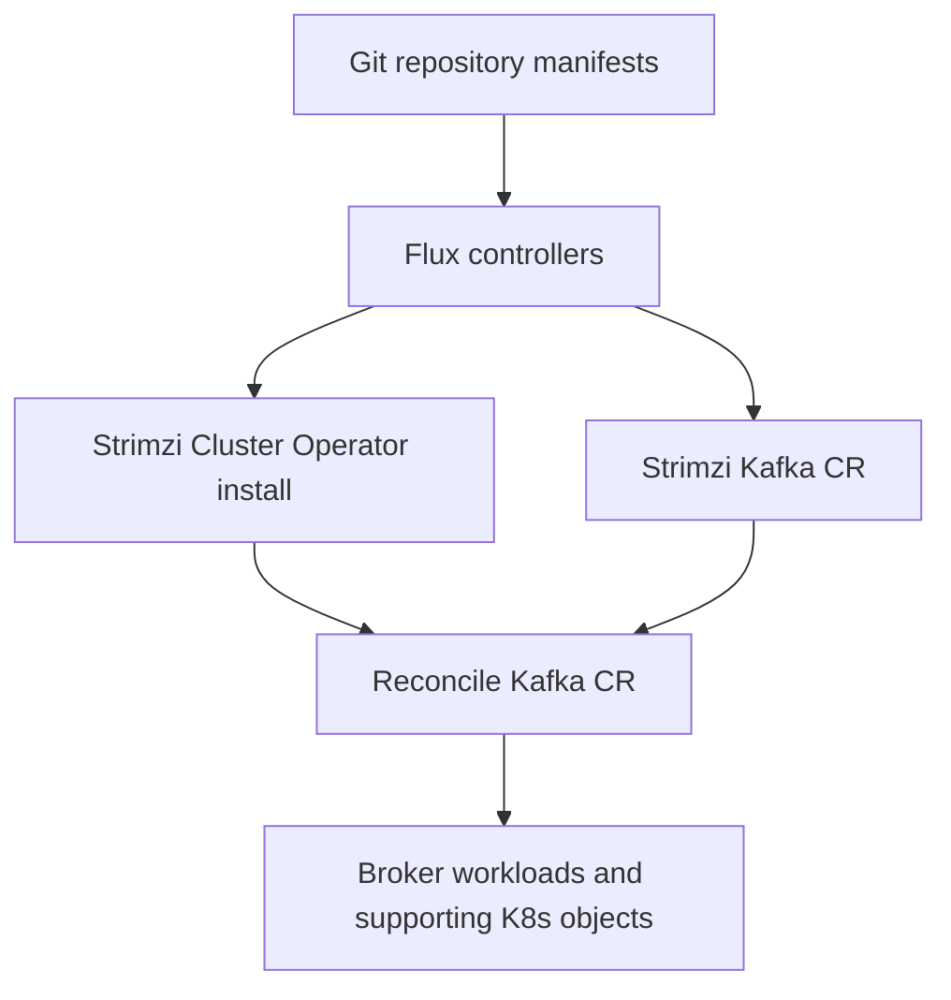

# feat: GitOps + Strimzi Kubernetes reference (non-portfolio)

## Overview

Pivot this repository from a portfolio-style content stub toward a **small, reproducible GitOps repository** that installs the **Strimzi Cluster Operator** and declares a **development-grade Apache Kafka cluster** using **Flux** against a **local Kubernetes cluster** (for example kind or k3d). The primary artifact is declarative manifests and operator-managed custom resources, not a marketing site.

## Problem Frame

The workspace currently mixes portfolio-oriented files (`content/strimzi.md`, `public/images/`, prior portfolio plan) with incomplete web tooling signals (`package-lock.json` without a root `package.json`, empty `src/layouts` and `src/pages`, `.astro` and `dist/` artifacts). The goal is a **single coherent product**: a cluster GitOps repo that a platform engineer can clone, bootstrap locally, and reconcile with Flux.

## Requirements Trace

- R1. **Flux-first delivery**: cluster desired state is expressed as Flux `Kustomization`/`HelmRelease` (and supporting Flux objects) pointing at paths in this repository.
- R2. **Strimzi-managed Kafka**: a `Kafka` custom resource (or equivalent supported Strimzi API) becomes the source of truth for brokers; the Strimzi operator reconciles it into runnable workloads.
- R3. **Local cluster target**: documented bootstrap for a disposable local cluster (kind or k3d) on macOS/Linux, including minimum resource expectations.
- R4. **Repo hygiene**: remove or relocate portfolio-only artifacts so the default README and directory layout read as an infrastructure repo.
- R5. **Verification story**: repeatable checks that prove Flux applied manifests and Strimzi reached a healthy `Kafka` status (automated where cheap, documented where not).

## Scope Boundaries

- Non-goal: production-grade HA sizing, full TLS/mTLS hardening, or multi-region disaster recovery in the first iteration.
- Non-goal: a bespoke Kafka client application (no long-lived Java/Go service in this repo unless explicitly added later).
- Non-goal: hosting documentation as the primary product beyond what operators need to run the stack (a short `docs/` is in scope; a polished marketing site is not).

## Staging model (cluster topology)

- **Single “dev” cluster path** in Git: one Flux `Kustomization` (or layered kustomizations) targeting `clusters/dev/` (name is illustrative; pick one convention and keep it consistent).
- **Namespaces**: separate namespaces for Flux-managed platform components vs workload namespaces are acceptable; the plan assumes explicit namespace objects or HelmRelease target namespaces.

## Context & Research

### Relevant Code and Patterns

- Present-day workspace (as of plan `date`) includes portfolio markdown, images, an older portfolio plan, and incomplete web build artifacts. Treat those as **legacy surface area to delete or move** rather than patterns to extend.
- No `AGENTS.md` was found; no `docs/solutions/` institutional notes were found.

### Institutional Learnings

- None located in-repo.

### External References

- Strimzi documentation: https://strimzi.io/documentation/
- Flux documentation: https://fluxcd.io/flux/

## Key Technical Decisions

- **Strimzi install style via Flux**: prefer a **Flux `HelmRelease`** for the Strimzi Helm chart **or** a pinned **Kustomize overlay** built from Strimzi’s published install bundles. Rationale: Flux-native drift detection and rollback semantics; pick one style for the whole operator install to avoid mixing unmanaged `kubectl apply` with Flux-owned objects without documenting exceptions.
- **Kafka mode**: default to **KRaft**-style `Kafka` specs supported by the chosen Strimzi major version (ZooKeeper-based layouts are intentionally out of scope unless required by version constraints discovered during implementation).
- **Ingress to brokers**: for local dev, prefer **internal listeners** and in-cluster clients first; expose outside the cluster only if the bootstrap doc explicitly needs host access (often via `NodePort`/`LoadBalancer` mappings on kind).

## Flux bootstrap v1 (locked, to remove ambiguity)

- **v1 model**: use **Flux CLI bootstrap** once per local cluster to install controllers into `flux-system` and to create the linkage objects (`GitRepository`, root `Kustomization`) that point at this repository.
- **In-repo boundary for v1**: this repository stores **only** the manifests Flux should reconcile for platform/workloads (starting under `clusters/dev/`), not a second copy of upstream `flux-system` controller installs unless your team explicitly chooses the “full GitOps of GitOps” model later.
- **First-run sequence (documentation obligation)**: `docs/bootstrap.md` must list commands in order: create kind cluster → `flux bootstrap` against the intended Git remote/branch → wait for root `Kustomization` → proceed to Strimzi/Kafka readiness checks.

## Open Questions

### Resolved During Planning

- **Primary deliverable**: GitOps + Strimzi manifests for a local Kubernetes cluster, not a portfolio web product.
- **Default local cluster engine**: **kind** is the default documented path; k3d remains optional appendix material only if needed.

### Deferred to Implementation

- **Exact Strimzi chart/OCI coordinates and Kafka version pin**: depends on compatibility matrix at implementation time.
- **`GitRepository` URL and branch**: depends on where this repository is hosted (fork vs upstream) and must match the remote used during `flux bootstrap`.

## High-Level Technical Design

> *This illustrates the intended approach and is directional guidance for review, not implementation specification. The implementing agent should treat it as context, not code to reproduce.*

## Implementation Units

- [x] **Unit 1: Repository pivot and baseline layout**

**Goal:** Make the repository read as an infrastructure GitOps project and remove confusing legacy artifacts.

**Requirements:** R1, R3, R4

**Dependencies:** None

**Files:**

- Create: `clusters/dev/` (or equivalent single entry path) with a `README.md` describing what Flux reconciles here
- Create: `docs/bootstrap.md` (prerequisites checklist in fixed order: container runtime, `kubectl`, `kind`, `flux` CLI, Git remote access, minimum CPU/RAM guidance; then cluster create/destroy; then Flux bootstrap assumptions matching **Flux bootstrap v1**)
- Modify: root `README.md` (replace portfolio framing with operator/GitOps framing)
- Modify: `.gitignore` (ignore local kubeconfigs, kind binaries, editor noise; ensure large web artifacts are not reintroduced accidentally)
- Delete or archive (choose one strategy and document it): portfolio-only paths such as `content/strimzi.md`, `public/images/`, `dist/`, `.astro/`, and orphaned web lockfiles if they are not part of the new product

**Approach:**

- If historical portfolio content must be preserved, move it under `archive/portfolio/` with an explicit note that it is not reconciled by Flux. Otherwise delete to reduce confusion.

**Test scenarios:**

- Test expectation: none -- repository layout and documentation change without executable product behavior; verification is the checklist below.
- Happy path (manual): a fresh clone contains no `node_modules/` and no `package-lock.json` unless the project intentionally adds a Node-based tool later.
- Edge case (manual): confirm `.gitignore` prevents committing generated cluster kubeconfigs if scripts write them locally.

**Verification:**

- A new reader opening the repo sees infra-first documentation and a clear `clusters/` entrypoint.

---

- [x] **Unit 2: Flux installation contract for this repo**

**Goal:** Define how Flux will reconcile this repository path to the dev cluster, including bootstrap assumptions and folder conventions.

**Requirements:** R1, R3

**Dependencies:** Unit 1

**Files:**

- Create: `clusters/dev/` Flux objects that match **Flux bootstrap v1** (typically a `GitRepository` plus one or more `Kustomization` objects that point at subpaths under this repo; exact filenames follow Flux conventions you choose, but must be consistent with bootstrap output or post-bootstrap patches documented in `docs/bootstrap.md`)
- Do **not** add `clusters/dev/flux-system/` placeholders in v1 unless you intentionally manage controller manifests in Git; the default is controllers live in-cluster from bootstrap, not duplicated here
- Test: `tests/scripts/check-flux-paths.sh` *(default: shell-based guard for repo-relative Flux path references; swap for a Go harness only if the repo later standardizes on Go tests)*

**Approach:**

- Choose one documented bootstrap path: **Flux CLI bootstrap** creating the `flux-system` linkage vs **existing cluster** where only additional `GitRepository`/`Kustomization` objects are applied. The plan requires the README to state which path is supported in v1.

**Test scenarios:**

- Happy path: `GitRepository` URL/ref and path fields match the actual folder layout under `clusters/dev/`.
- Error path: an intentionally invalid path in a fixture fails the path check script (if implemented).

**Verification:**

- After `flux bootstrap` per `docs/bootstrap.md`, Flux shows the root `Kustomization` reconciling the `clusters/dev/` entrypoint without requiring undocumented manual `kubectl apply` steps.

---

- [x] **Unit 3: Strimzi Cluster Operator via Flux**

**Goal:** Install Strimzi’s operator controllers using Flux-owned objects.

**Requirements:** R1, R2, R5

**Dependencies:** Unit 2

**Files:**

- Create: `infrastructure/strimzi/` *(path illustrative; keep one convention: platform installs live under `infrastructure/`, Kafka workload CRs live under `apps/`)* containing HelmRelease or kustomization bundle for Strimzi operator install
- Create: supporting `Namespace` and RBAC objects only if not created by the chosen install method
- Test: `tests/manifests/strimzi-operator.kubeconform.yaml` **or** `tests/scripts/kubeconform.sh` validating rendered manifests *(pick one tool; kubeconform is a common lightweight choice)*

**Approach:**

- Pin versions via Flux `HelmChart` version fields or pinned kustomize remote bases; record upgrade policy in `docs/bootstrap.md` (who bumps pins, and how).

**Test scenarios:**

- Happy path: rendered manifests include namespace scoping consistent with Strimzi docs for the chosen install method.
- Error path: kubeconform rejects an intentionally broken manifest added in test fixtures (if a fixture harness exists).

**Verification:**

- `kubectl get pods -n strimzi-system` shows operator pods ready after reconciliation.

---

- [x] **Unit 4: Minimal `Kafka` cluster for local dev**

**Goal:** Declare a development Kafka cluster via Strimzi CRs reconciled by Flux.

**Requirements:** R2, R3, R5

**Dependencies:** Unit 3

**Files:**

- Create: `apps/kafka-dev/` *(path illustrative)* with `Kafka` CR and supporting options (storage class assumptions for kind/k3d, listener configuration, resource requests)
- Test: `tests/manifests/kafka-dev.kubeconform.yaml` **or** extend `tests/scripts/kubeconform.sh`

**Approach:**

- Keep brokers to the smallest viable count for dev; document CPU/memory expectations and how to tune requests/limits if laptops cannot schedule defaults.
- Because **kind** is the default engine, call out the default `StorageClass` behavior on kind and how Strimzi `Kafka` persistent volume claims map to it (or switch to ephemeral storage for dev if that matches team policy).

**Test scenarios:**

- Happy path: `Kafka` resource reaches Ready (or Strimzi’s equivalent status condition set) in reasonable time on a fresh kind cluster.
- Edge case: storage class mismatch surfaces as a clear Strimzi status message; bootstrap doc lists how to set kind’s default storage class expectations.

**Verification:**

- `kubectl get kafka -A` shows the cluster object and status indicates operational readiness for the declared listeners.

---

- [x] **Unit 5: Smoke verification and operator-facing docs**

**Goal:** Provide a repeatable smoke path that validates GitOps + Strimzi end-to-end without introducing a full application codebase.

**Requirements:** R5, R3

**Dependencies:** Unit 4

**Files:**

- Create: `hack/smoke.sh` *(or `Makefile` targets)* documenting kubectl checks and optional in-cluster `kafka-console-producer` / `kafka-console-consumer` one-liners using Strimzi helper resources if you choose to generate them
- Modify: `docs/bootstrap.md` to include the smoke section and troubleshooting (Flux `Kustomization` status, Strimzi CR conditions, common scheduling failures)

**Approach:**

- Prefer checks that fail closed: verify not only pods running, but **Kafka CR conditions** and **Flux Kustomization ready** states.

**Test scenarios:**

- Integration: from a clean cluster, running the documented bootstrap + smoke sequence completes without undocumented manual edits.
- Error path: smoke script exits non-zero when Kafka CR reports a not-ready condition after a bounded timeout.

**Verification:**

- A second engineer can follow docs once and reach the same smoke success criteria.

---

- [x] **Unit 6 (optional): PR validation for manifests**

**Goal:** Add CI that validates YAML/Kubernetes shape for pull requests.

**Requirements:** R5

**Dependencies:** Unit 3 *(minimum; can also depend on Unit 4 if you validate all rendered manifests together)*

**Files:**

- Create: `.github/workflows/validate-manifests.yml`
- Test: workflow itself is the automated harness; add a fixture negative case if GitHub Actions is enabled

**Approach:**

- Keep CI fast: kubeconform + pinned Kubernetes version schema; avoid cluster bring-up in CI for v1 unless explicitly needed.

**Test scenarios:**

- Happy path: valid manifests pass on PR.
- Error path: invalid manifest fails CI with actionable output.

**Verification:**

- A PR that breaks schema fails CI before merge.

## System-Wide Impact

- **Unchanged invariants:** None from a prior production system; this repo is greenfield aside from legacy portfolio files slated for removal or archival.
- **Integration coverage:** Flux → operator install → `Kafka` readiness is the primary cross-layer chain; smoke checks must exercise that chain, not only pod existence.

## Risks & Dependencies

| Risk | Mitigation |
|------|------------|
| Laptop resource limits prevent Kafka scheduling | Document minimum CPU/RAM; reduce broker count and JVM-related settings for dev |
| Strimzi API/version skew | Pin versions; document upgrade steps |
| Flux bootstrap confusion (`flux-system` ownership) | Document one supported bootstrap model; avoid ambiguous split ownership |

## Documentation / Operational Notes

- `docs/bootstrap.md` becomes the authoritative runbook for local lifecycle (create cluster, bootstrap Flux, wait for readiness, smoke, teardown).

## Sources & References

- **Origin document:** none
- Related prior plan (portfolio-era, may be superseded for product direction): `docs/plans/2026-04-19-001-feat-strimzi-portfolio-web-section-plan.md`
- External docs: [Strimzi documentation](https://strimzi.io/documentation/), [Flux documentation](https://fluxcd.io/flux/)
